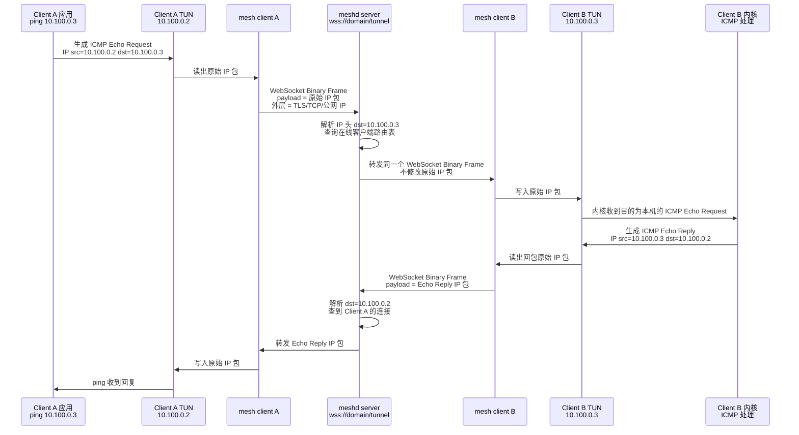

# Mesh VPN

基于 WebSocket over TLS 的自托管内网互联系统。所有流量伪装为标准 HTTPS，无法被 DPI 识别。

## 特性

- 流量完全伪装为 HTTPS（端口 443，合法 TLS 证书）
- 纯 Go 实现，零外部命令依赖
- 星型拓扑，所有流量经服务器中继
- 自动获取 Let's Encrypt 证书
- 断线自动重连
- 支持 macOS (arm64) 和 Linux (amd64)

## 架构

```
┌─────────┐    wss://domain/tunnel     ┌──────────┐    wss://domain/tunnel    ┌─────────┐
│ Client A│◄──────────────────────────►│  Server  │◄────────────────────────►│ Client B│
│ (TUN)   │      TLS 1.3 / :443       │  (TUN)   │      TLS 1.3 / :443     │ (TUN)   │
└─────────┘                            └──────────┘                          └─────────┘
```

### 完整报文转发示意

以 `Client A = 10.100.0.2` ping `Client B = 10.100.0.3` 为例，应用看到的是普通内网 IP 通信；Mesh 只负责把原始 IP 包装进 WebSocket/TLS 隧道，中间不做 NAT，也不改写源/目的 IP。



报文在不同层看到的形态大致如下：

| 位置 | 报文形态 | 说明 |
|------|----------|------|
| Client A 应用/内核 | `ICMP Echo Request` inside `IP(10.100.0.2 → 10.100.0.3)` | 用户执行的普通 `ping` |
| Client A TUN → mesh | 原始 IP 包 | TUN 中读出的就是完整 IP 包 |
| mesh client → server | `WebSocket Binary Frame(payload=原始 IP 包)` inside `TLS/TCP/公网 IP` | 对外表现为标准 HTTPS/WSS 流量 |
| server 内部 | 原始 IP 包 | server 只解析 IP 头里的目的地址做路由决策 |
| server → Client B | `WebSocket Binary Frame(payload=同一个原始 IP 包)` | 不做 NAT，不重写 `src/dst` |
| Client B TUN/内核 | `ICMP Echo Request` inside `IP(10.100.0.2 → 10.100.0.3)` | 内核像收到普通内网包一样处理并生成回包 |

如果 ping 的目标是服务器自身 `10.100.0.1`，server 发现目的地址等于自己的 TUN IP 后，会把包写入 server TUN，让服务器内核处理；服务器内核生成的 Echo Reply 再由 server 从 TUN 读出，并按目的地址转发回对应客户端。

## 安装

### 一键安装（推荐）

```bash
# 服务器（Linux，需要 root）
curl -fsSL https://raw.githubusercontent.com/kvmaker/mesh/master/install.sh | sudo bash -s -- server --domain your.domain.com

# 客户端（macOS / Linux，需要 root）
curl -fsSL https://raw.githubusercontent.com/kvmaker/mesh/master/install.sh | sudo bash -s -- client

# 卸载
curl -fsSL https://raw.githubusercontent.com/kvmaker/mesh/master/install.sh | sudo bash -s -- uninstall
```

### 从源码构建

```bash
# 服务器（Linux amd64）
GOOS=linux GOARCH=amd64 go build -o meshd ./cmd/meshd

# 客户端（macOS arm64）
GOOS=darwin GOARCH=arm64 go build -o mesh ./cmd/mesh

# 客户端（Linux amd64）
GOOS=linux GOARCH=amd64 go build -o mesh ./cmd/mesh
```

或使用 Makefile：

```bash
make build-linux    # 生成 bin/meshd-linux-amd64 + bin/mesh-linux-amd64
make build-darwin   # 生成 bin/mesh-darwin-arm64
```

## 部署

### 前提条件

- 一台有公网 IP 的 Linux 服务器
- 一个域名，DNS A 记录指向服务器 IP
- 服务器开放端口 443（HTTPS）和 80（ACME 证书验证）

### 方式一：使用安装脚本（推荐）

#### 服务器

```bash
# 构建
make build-linux

# 上传并安装（一键完成：安装二进制 + 创建配置 + 初始化 + 创建 systemd 服务）
scp bin/meshd-linux-amd64 scripts/install-server.sh user@server:/tmp/
ssh user@server "sudo /tmp/install-server.sh /tmp/meshd-linux-amd64"

# 修改配置中的 domain 字段
ssh user@server "sudo vi /etc/mesh/meshd.yaml"

# 启动
ssh user@server "sudo systemctl start meshd"
```

#### macOS 客户端

```bash
# 构建
make build-darwin

# 安装（安装二进制 + 创建 launchd plist）
sudo ./scripts/install-client.sh bin/mesh-darwin-arm64

# 注册（不需要 root）
mesh join your-domain.com --token <token>

# 启动后台服务
sudo launchctl load /Library/LaunchDaemons/com.mesh.vpn.plist
```

#### Linux 客户端

```bash
# 构建
make build-linux

# 安装（安装二进制 + 创建 systemd 服务）
sudo ./scripts/install-client.sh bin/mesh-linux-amd64

# 注册
mesh join your-domain.com --token <token>

# 启动后台服务
sudo systemctl start mesh
```

#### 卸载

```bash
sudo ./scripts/uninstall.sh
```

### 方式二：手动部署

```bash
# 1. 上传二进制
scp meshd user@server:/usr/local/bin/meshd

# 2. 创建配置
sudo mkdir -p /etc/mesh/certs
sudo cat > /etc/mesh/meshd.yaml << 'EOF'
domain: "your-domain.com"
listen_addr: ":443"
network: "10.100.0.0/24"
data_dir: "/etc/mesh"
cert_dir: "/etc/mesh/certs"
tun_name: "mesh0"
tun_mtu: 1300
EOF

# 3. 初始化（生成 Token）
sudo meshd init

# 4. 创建 systemd 服务
sudo cat > /etc/systemd/system/meshd.service << 'EOF'
[Unit]
Description=Mesh VPN Server
After=network-online.target
Wants=network-online.target

[Service]
Type=simple
ExecStart=/usr/local/bin/meshd run
Restart=always
RestartSec=5
AmbientCapabilities=CAP_NET_ADMIN CAP_NET_RAW CAP_NET_BIND_SERVICE

[Install]
WantedBy=multi-user.target
EOF

# 5. 启动
sudo systemctl daemon-reload
sudo systemctl enable --now meshd
```

### 客户端使用

```bash
# 1. 注册设备（不需要 root）
mesh join your-domain.com --token <token>

# 2. 启动隧道（需要 root，创建 TUN 设备）
sudo mesh up

# 3. 验证连接
ping 10.100.0.1    # ping 服务器
ping 10.100.0.x    # ping 其他客户端
```

### macOS 后台服务（launchd）

```bash
sudo cat > /Library/LaunchDaemons/com.mesh.vpn.plist << 'EOF'
<?xml version="1.0" encoding="UTF-8"?>
<!DOCTYPE plist PUBLIC "-//Apple//DTD PLIST 1.0//EN" "http://www.apple.com/DTDs/PropertyList-1.0.dtd">
<plist version="1.0">
<dict>
    <key>Label</key>
    <string>com.mesh.vpn</string>
    <key>ProgramArguments</key>
    <array>
        <string>/usr/local/bin/mesh</string>
        <string>up</string>
    </array>
    <key>EnvironmentVariables</key>
    <dict>
        <key>HOME</key>
        <string>/Users/YOUR_USERNAME</string>
    </dict>
    <key>RunAtLoad</key>
    <true/>
    <key>KeepAlive</key>
    <true/>
    <key>StandardOutPath</key>
    <string>/tmp/mesh.log</string>
    <key>StandardErrorPath</key>
    <string>/tmp/mesh.log</string>
</dict>
</plist>
EOF

sudo launchctl load /Library/LaunchDaemons/com.mesh.vpn.plist
```

## 管理命令

### 服务器

```bash
meshd init              # 初始化（生成密钥和 Token）
meshd run               # 启动服务
meshd token show        # 查看注册 Token
meshd token reset       # 重新生成 Token
meshd device list       # 列出所有设备
meshd device remove <name|id>  # 移除设备
```

### 客户端

```bash
mesh join <domain> --token <token>  # 注册设备
mesh up                             # 启动隧道（需 sudo）
mesh status                         # 查看状态
mesh leave                          # 注销并清理
```

## 网络规划

| 角色 | IP |
|------|-----|
| 服务器 | 10.100.0.1 |
| 客户端（自动分配） | 10.100.0.2 ~ 10.100.0.254 |

## e2e 测试

基于 Docker 的端到端测试（3 容器：1 server + 2 client），验证连通性、性能、故障恢复。

```bash
# 快速模式（连通性 + 性能，约 2-3 分钟）
bash tests/e2e/run.sh --quick

# 全量（含故障场景）
bash tests/e2e/run.sh --all

# 单个场景
bash tests/e2e/run.sh --scenario 01

# 性能硬门槛（release 用）
STRICT=1 bash tests/e2e/run.sh --quick
```

结果输出到 `tests/e2e/results/<timestamp>/`，含各场景 JSON 指标和 `summary.txt`。

> 注：macOS 本机若 docker 走 colima，需先 `export DOCKER_HOST=unix://$HOME/.colima/default/docker.sock`；CI（ubuntu-latest）无需。

详见 `docs/superpowers/specs/2026-07-08-e2e-docker-design.md`。

## 技术栈

- Go 1.22+
- WebSocket: [github.com/coder/websocket](https://github.com/coder/websocket)
- TUN: [golang.zx2c4.com/wireguard/tun](https://golang.zx2c4.com/wireguard)（仅 TUN 设备抽象）
- TLS: Let's Encrypt via `golang.org/x/crypto/acme/autocert`
- 数据库: SQLite via `modernc.org/sqlite`
- CLI: `github.com/spf13/cobra`
