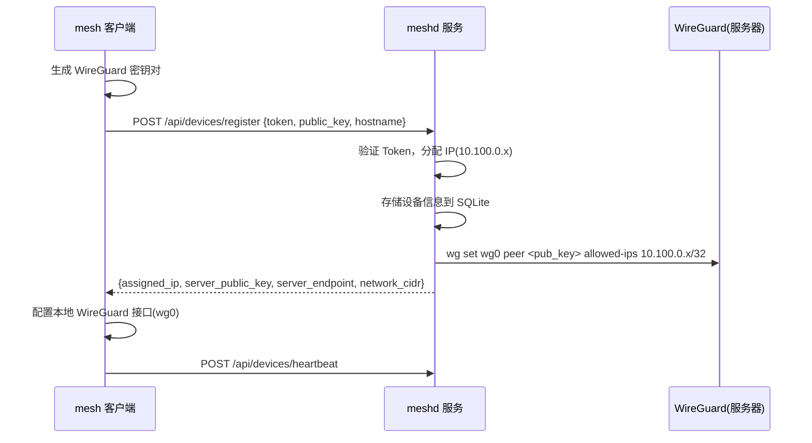
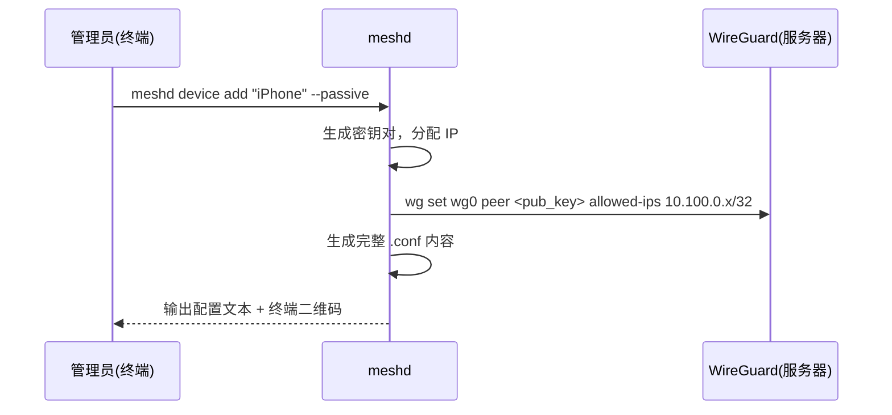

# Mesh VPN 系统设计文档

## 概述

一个自托管的内网互联系统，使用公网 Linux 服务器作为 WireGuard Hub，为 macOS、Linux、iOS 设备提供虚拟局域网。所有流量经服务器中继转发（星型拓扑），无 NAT 穿透逻辑。

## 需求

| 维度 | 决策 |
|------|------|
| 场景 | 远程访问设备（SSH、NAS 等） |
| 规模 | 5-10 台设备 |
| 网络模型 | 全量走公网服务器中继（星型拓扑） |
| 数据面 | WireGuard |
| 客户端平台 | macOS CLI、Linux CLI、iPhone 用官方 WireGuard App |
| 管理方式 | 纯 CLI |
| 认证 | 全局单 Token（pre-shared key） |
| 语言 | Go |

## 网络架构

### IP 规划

- 虚拟网段：`10.100.0.0/24`（254 台设备容量）
- 服务器（Hub）：`10.100.0.1`
- 设备（动态分配）：`10.100.0.2` ~ `10.100.0.254`
- WireGuard 监听端口：UDP 51820

### 流量模型

```
节点A(10.100.0.2) → WireGuard隧道 → 服务器(10.100.0.1) → WireGuard隧道 → 节点B(10.100.0.3)
```

服务器开启 `net.ipv4.ip_forward=1`，WireGuard 内核模块根据 Peer 的 AllowedIPs 自动转发。

## 系统组件

### meshd（服务器端）

运行在公网 Linux 服务器上，既是守护进程也是管理工具。

**守护进程模式（`meshd run`）：**

- 管理 WireGuard 接口（wg0）
- 提供 REST API 供客户端注册和心跳
- 监听端口：TCP 8080（供设备注册/心跳）

**管理命令：**

```bash
meshd init                          # 初始化：生成服务器密钥、Token、创建数据库
meshd run                           # 启动守护进程

meshd token show                    # 查看当前 Token
meshd token reset                   # 重新生成 Token（旧 Token 立即失效）

meshd device list                   # 列出所有设备
meshd device remove <name|id>       # 移除设备
meshd device add <name> --passive   # 创建被动设备（iPhone），输出配置 + 终端二维码
meshd device show <name>            # 重新显示被动设备配置/二维码

meshd status                        # 查看 WireGuard Peer 状态
```

**技术栈：** Go + SQLite

### mesh（客户端）

运行在 macOS/Linux 上的命令行工具。

```bash
mesh join <server> --token <token>  # 注册到服务器，自动配置 WireGuard
mesh status                         # 查看连接状态、在线设备
mesh leave                          # 注销设备，清理本地配置
```

**本地 WireGuard 管理：** 调用 `wg` 和 `ip`/`ifconfig` 命令。macOS 使用 wireguard-go 用户态实现。

### iPhone 支持

通过 `meshd device add --passive` 生成完整 WireGuard 配置，终端显示二维码。用户用 iPhone 官方 WireGuard App 扫码导入。

## 数据流

### 设备注册



### 被动设备创建



### 心跳机制

- 客户端每 30 秒发送心跳：`POST /api/devices/heartbeat`
- 超过 90 秒未收到心跳标记为离线
- WireGuard `PersistentKeepalive = 25` 保持 NAT 映射

## REST API

API 仅供 mesh 客户端调用，监听 TCP 8080。

| 方法 | 路径 | 说明 | 认证 |
|------|------|------|------|
| POST | `/api/devices/register` | 设备注册 | Token |
| POST | `/api/devices/heartbeat` | 上报心跳 | Device Secret |
| DELETE | `/api/devices/:id` | 注销设备 | Device Secret |

### 认证方式

- **注册请求**：携带全局 Token
- **后续请求**：注册成功后返回 Device Secret，客户端用 `Authorization: Bearer <device_secret>` 认证

### 数据结构

```go
type Device struct {
    ID        string
    Name      string
    PublicKey string
    IP        string
    Secret    string
    LastSeen  time.Time
    Online    bool
    Passive   bool      // true=被动设备(iPhone), false=主动设备(CLI)
}
```

## 安全设计

### 传输安全

- 控制面 API：HTTP（注册请求中 Token 通过明文传输，但注册操作通常在首次连接时执行一次；如需加强可前置 TLS）
- 数据面：WireGuard Noise 协议加密

### Token

- 全局唯一，`meshd init` 时生成（32 字节随机字符串）
- 长期有效，`meshd token reset` 可重新生成

### Node Secret

- 设备注册成功后服务端生成（32 字节随机字符串）
- 客户端存储于 `~/.mesh/config.json`（权限 0600）
- 用于心跳和注销的身份认证

### 密钥存储

| 文件 | 位置 | 权限 |
|------|------|------|
| 服务器 WireGuard 私钥 | `/etc/mesh/server.key` | 0600 |
| 全局 Token | `/etc/mesh/token` | 0600 |
| 被动设备私钥 | 仅在 `device add` 时输出，不持久存储 | - |
| 客户端私钥 | `~/.mesh/private.key` | 0600 |
| 客户端配置 | `~/.mesh/config.json` | 0600 |

### 防护

- 注册接口限流：单 IP 每分钟最多 5 次
- API 请求体限制：1MB

## 部署

### 服务器

**系统要求：** Linux 内核 5.6+（自带 WireGuard）、公网 IP、开放 UDP 51820 + TCP 8080

**文件布局：**

```
/usr/local/bin/meshd
/etc/mesh/
├── meshd.yaml          # 配置文件
├── server.key          # WireGuard 私钥
├── token               # 全局 Token
└── mesh.db             # SQLite 数据库
```

**meshd.yaml：**

```yaml
server:
  endpoint: "your-server.com:51820"
  listen_port: 51820
  api_port: 8080
  network: "10.100.0.0/24"
```

**启动：**

```bash
meshd init    # 首次初始化
meshd run     # 启动（建议配合 systemd）
```

### 客户端

**macOS：**

```bash
brew install wireguard-tools
# 下载 mesh 二进制
mesh join your-server.com --token <token>
```

**Linux：**

```bash
# WireGuard 通常已内置
mesh join your-server.com --token <token>
```

**客户端文件：**

```
~/.mesh/
├── config.json       # 服务器地址、device_secret、分配的 IP
└── private.key       # WireGuard 私钥
```

## 错误处理

### 连接恢复

- 客户端重启：检查 `~/.mesh/config.json`，已注册则直接恢复 WireGuard 接口
- 服务器重启：从 SQLite 读取所有节点，重建 WireGuard Peer 配置
- 网络切换：WireGuard roaming 特性自动恢复

### 冲突处理

- IP 分配：原子递增 + SQLite 唯一约束
- 重复注册：同一公钥重复注册返回已有信息（幂等）
- 设备名重复：允许，UUID 为唯一标识

### 清理

- 离线超过 7 天标记为 `inactive`
- 手动 `meshd device remove` 删除设备并回收 IP

### 系统限制

- 最大设备数：254（/24 子网）
- 心跳间隔：30 秒，超时：90 秒
